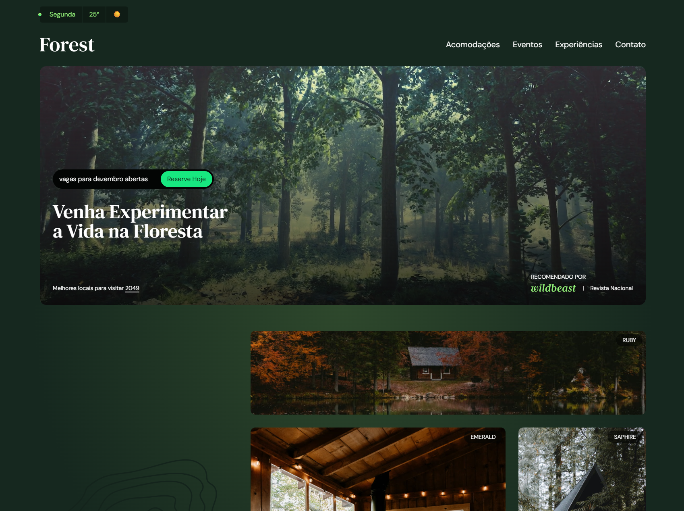

# Forest - Landing Page com Tailwind CSS

Este projeto é uma landing page responsiva para o "Forest", um conceito de refúgio e hotel na floresta. O principal objetivo do seu desenvolvimento foi a aplicação prática e o aprofundamento no framework **Tailwind CSS**, explorando suas funcionalidades para criar uma interface moderna, rica em detalhes e totalmente adaptável a diferentes dispositivos.



## ✨ Foco do Projeto

O desenvolvimento foi centrado em utilizar o Tailwind CSS para construir um layout complexo e responsivo do zero. A ênfase foi em:

-   **Abordagem Utility-First:** Utilizar classes de utilitário para estilizar todos os elementos diretamente no HTML, agilizando o desenvolvimento e mantendo a consistência visual.
-   **Responsividade:** Garantir que a página se adapte perfeitamente a diferentes tamanhos de tela, desde dispositivos móveis até desktops, utilizando as diretivas de responsividade do Tailwind (`sm:`, `md:`, `lg:`).
-   **Customização do Tema:** Personalizar o `tailwind.config.js` para incluir cores, fontes e espaçamentos específicos do projeto (ex: `verde-800`, `font-serif`), criando uma identidade visual única.
-   **Estados e Microinterações:** Aplicar classes de estado como `hover:`, `focus:` e `group-hover:` para criar interações que melhoram a experiência do usuário.
-   **Animações:** Explorar as classes de animação do Tailwind para adicionar efeitos sutis de fade-in e transições suaves, tornando a navegação mais fluida.
-   **Layouts Complexos com Grid e Flexbox:** Construir seções com layouts avançados, combinando as funcionalidades de Grid e Flexbox que o Tailwind oferece.

## 🚀 Tecnologias Utilizadas

-   **HTML5:** Para a estrutura semântica da página.
-   **Tailwind CSS:** Como o principal framework para estilização, utilizando sua abordagem *utility-first* para criar um design customizado e responsivo.
-   **JavaScript (Vanilla):** Para adicionar interatividade e dinamismo a componentes específicos, como:
    -   Exibição da data e de uma "previsão do tempo" aleatória.
    -   Troca dinâmica do vídeo de fundo com base na condição climática gerada.
    -   Controle de abertura e fechamento do menu de navegação em dispositivos móveis.
-   **Google Fonts:** Para a importação das fontes `DM Sans` e `DM Serif Text`, essenciais para a identidade visual do projeto.

## 📋 Funcionalidades

O projeto conta com diversas seções e funcionalidades interativas:

-   **Header Dinâmico:** Mostra o dia da semana atual e uma condição climática simulada que altera o ícone (☀️/🌧️) e o vídeo de fundo da seção principal.
-   **Menu Mobile:** Um menu de navegação funcional e acessível para telas menores, que é ativado com JavaScript.
-   **Seções de Conteúdo:**
    -   **Acomodações:** Apresenta as cabanas disponíveis com um layout em grid.
    -   **Eventos:** Cards com eventos astronômicos, dispostos em um carrossel horizontal com snap-scroll.
    -   **Experiências:** Descreve as atividades oferecidas, com imagens interativas que revelam legendas ao passar o mouse.
    -   **Contato:** Um formulário de contato e informações de endereço.
-   **Design Totalmente Responsivo:** A página é 100% adaptável, com o layout sendo reajustado para uma ótima experiência de visualização em qualquer dispositivo.
-   **Microinterações:** Efeitos de `hover` em botões, links e imagens para uma navegação mais engajante.

## 🖼️ Estrutura do Projeto

```
/
├── img/                # Contém todas as imagens, ícones e vídeos
│   ├── ...
├── index.html          # Arquivo principal da página
├── output.css          # CSS gerado pelo Tailwind
├── tailwind.config.js  # Arquivo de configuração do Tailwind
├── package.json        # Dependências de desenvolvimento (ex: tailwindcss)
└── README.md           # Este arquivo
```
